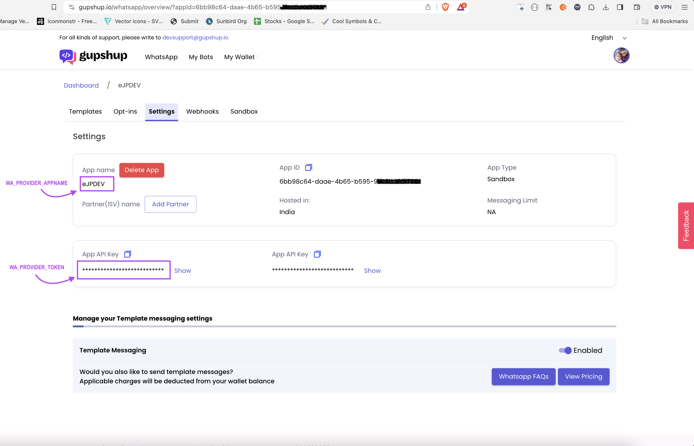
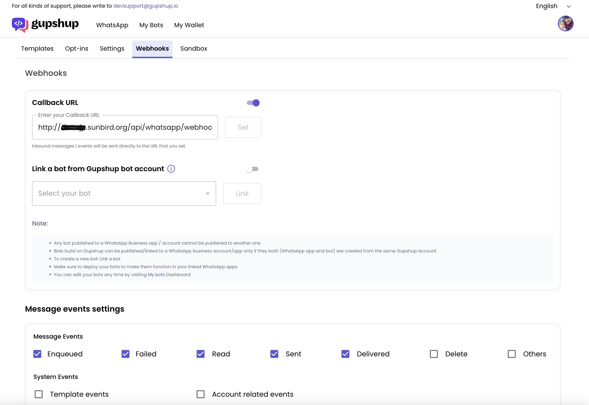

# Gupshup  
## [Setup & Going Live](https://docs.gupshup.io/docs/setup-going-live)  
## [Configuring & testing webhook](https://docs.gupshup.io/docs/set-webhookcallback-url)  

 ### Webhook
 Make sure `whatsapp-bot` service is accessible using public domain host address(with port number in the host). Because Gupshup webhook will only allow to set the webhook public host URL endpoint.  
    ex:`https://eJP.sunbird.org/api/whatsapp/webhook`

which is redirecting to `whatsapp-bot` service url by API Manager  
    ex: `https://<remote-ip>:3010/gupshup/webhook`  

## API documentation
 [Gupshup - API documentation](https://docs.gupshup.io/reference/msg)  
